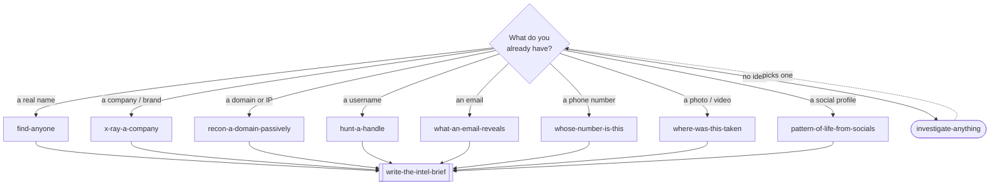
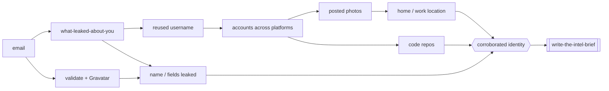
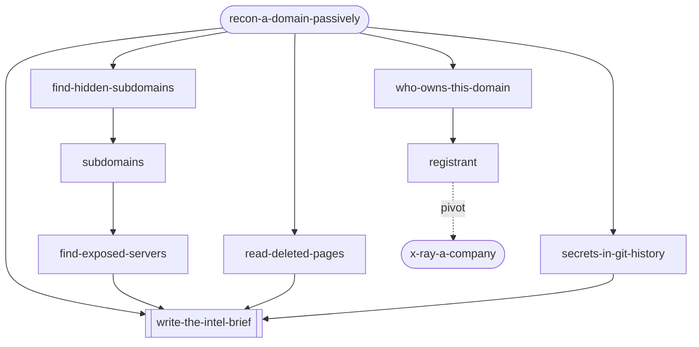

<div align="center">

# 🕵️ OSINT Skills

**Open-source intelligence, run by your AI agent.**

Reconnaissance · Attribution · GEOINT · Breach checks · Due diligence

[](LICENSE)
[](#workflows--you-type-these)
[](https://www.skills.sh/useosint/osint-skills)
[](#install)
[](ETHICS.md)
[](CONTRIBUTING.md)

</div>

---

28 skills that let Cursor, Claude, and other coding agents actually run an
open-source-intelligence investigation — pivot from an email to a breach to a
reused handle to a real name, geolocate a photo from the pixels, map a
company's subsidiaries — and write it up with sources instead of vibes.

Two kinds:

- **10 you run by name** — end-to-end workflows for a person, company, domain,
  username, email, phone, photo, or social account.
- **18 the agent reaches for on its own** — the individual techniques those
  workflows lean on (reverse image search, WHOIS, certificate transparency,
  breach lookups, chronolocation, and so on).

You point it at a target. It picks the workflow, chains the techniques, and
hands back a report where every claim has a source and a confidence level.

These aren't cheat sheets. Every skill carries the tradecraft that separates a
lead from a finding — where each source lies to you, which results are
artefacts of how the tool works, and what it takes to call something confirmed.
Each one ships with `reference/` material too: the query cookbooks, per-country
indicator guides, registry catalogues, and format tables you'd otherwise keep
in a browser tab.

## What a run looks like

```
> recon-a-domain-passively example.com

scope        passive only, no scanning
whois        NameCheap, created 2019-03-11, registrant behind privacy guard
dns          MX → Google Workspace · SPF lists sendgrid + mailgun
crt.sh       14 subdomains, incl. staging.example.com and vpn.example.com
shodan       vpn:443 Fortinet · staging exposes :8080 Jenkins (no auth)
wayback      2021 team page named 6 staff, since deleted

pivoted 3 staff → LinkedIn, flagged the open Jenkins, wrote report.md
```

Illustrative — a real run depends on the target and which tools you have keys
for. The skills are the technique and the tooling; some tools (Shodan, HIBP,
DeHashed) want their own API key, and free alternatives are called out inline.

## useOSINT API (agents)

When `USEOSINT_API_KEY` is set, agents should **prefer the hosted API** for
capabilities marked `hosted_lookup` in the live catalog — then fall back to the
DIY Reach-for tables on 401/402/429/timeout.

| | |
|--|--|
| Catalog (API stubs + preference rule) | https://useosint.com/catalog.json?src=agent-skills |
| Canonical copy in this repo | [`catalog.json`](catalog.json) |
| API | `POST https://api.useosint.com/v1/search?src=agent-skills` |
| Keys | https://app.useosint.com |
| Env | `USEOSINT_API_KEY` |

Rebuild the repo catalog after marketing-site skill metadata changes:

```bash
python3 scripts/build_agent_catalog.py
```

Deploy `catalog.json` to useosint.com so the live URL matches this contract.
Attribution: agent curls use `src=agent-skills` + `X-Useosint-Src`; MCP uses
`src=mcp`.

## Install

```bash
git clone https://github.com/useosint/osint-skills.git
cd osint-skills
./install.sh
```

`install.sh` symlinks all 28 skills into `~/.cursor/skills`, so `git pull` keeps
them current. Restart your agent afterward.

| Command | Installs to |
|---------|-------------|
| `./install.sh` | `~/.cursor/skills` (symlink) |
| `./install.sh --copy` | same, but copies |
| `./install.sh --claude` | `~/.claude/skills` |
| `./install.sh --target DIR` | anywhere |

For a single project instead of your whole machine, drop the `skills/` folder
into that repo's `.cursor/skills/`.

## Where to start

Pick the workflow that matches whatever you're holding. If you don't know,
`investigate-anything` routes you.



## Workflows — you type these

| Skill | Does |
|-------|------|
| `investigate-anything` | Router. Scope gate, collection plan, source grading, and it picks the workflow. |
| `find-anyone` | Profile an individual — and survive the name-collision problem |
| `x-ray-a-company` | Due diligence — entity, ownership, people, infra, risk |
| `recon-a-domain-passively` | Map a domain, site, or IP without sending it a packet |
| `hunt-a-handle` | Chase a handle across hundreds of platforms, then prove it's the same person |
| `what-an-email-reveals` | Validate it, find the accounts it registered, pivot to the owner |
| `whose-number-is-this` | Line type, carrier, VoIP detection, messaging-app exposure |
| `where-was-this-taken` | Metadata, provenance, geolocation, and time — in that order |
| `pattern-of-life-from-socials` | Network, content, and posting rhythm — and what that reveals |
| `write-the-intel-brief` | Turn findings into a sourced brief that separates fact from inference |

## Techniques — the agent pulls these in as needed

| Skill | For |
|-------|-----|
| `find-the-original-image` | First publication of an image, across Yandex, Lens, Bing, TinEye |
| `secrets-in-file-metadata` | GPS, device serials, authors, and edit chains in files and documents |
| `who-owns-this-domain` | WHOIS/RDAP, DNS, and the vendors an SPF record gives away |
| `find-hidden-subdomains` | Certificate transparency, passive DNS, and the hosts that no longer resolve |
| `read-deleted-pages` | Wayback CDX, archive.today, and getting the raw capture |
| `google-like-a-spy` | Operators that still work, on the engines that still honour them |
| `secrets-in-git-history` | Author emails, deleted-fork data, and credentials that never touched HEAD |
| `geolocate-from-pixels` | Bollards, plates, shadows, sun angle — location and time from the frame alone |
| `investigate-without-getting-made` | Your attribution surface, and the persona that doesn't leak back to you |
| `what-leaked-about-you` | Breach exposure, k-anonymity lookups, and why you never touch the credential |
| `follow-the-crypto` | Clustering, change addresses, and the off-ramp where identity attaches |
| `track-planes-and-ships` | ICAO hex vs tail number, IMO vs MMSI, and who's gone dark |
| `find-exposed-servers` | Shodan and Censys queries, favicon hashes, origin IPs behind the CDN |
| `find-leaks-in-the-wild` | Pastes, forums, Telegram — and telling a fresh leak from a recycled combolist |
| `is-this-photo-real` | Provenance first, pixels last, and why ELA is usually read wrong |
| `dig-through-data-brokers` | Broker records as leads, plus the FCRA line you don't cross |
| `who-really-owns-it` | Registries, filings, beneficial ownership, and the nominee problem |
| `graph-the-network` | A schema, a source on every edge, and the bridging node you'd otherwise miss |

## How a case actually moves

It's a chain of pivots. One thing you know turns into the next, until the
picture holds together under more than one source. Start with an email and it
can unfold like this:



Every hop is one of the technique skills; nothing gets called a fact off a
single weak match. And a workflow isn't one lookup — `recon-a-domain-passively`, for
example, fans out across several techniques at once:



## Rules

OSINT is collecting information that is already public, for a legitimate reason.
That's legal most places. Logging into someone's accounts, using leaked
passwords, scanning boxes you don't own, stalking, doxxing — that isn't, and
it's not what any of this is for.

Every workflow makes you state scope and authorization before it does anything,
and stays passive by default. The details are in [ETHICS.md](ETHICS.md). If your
goal is to hurt a specific person, these skills aren't for you.

## Contributing

One folder, one `SKILL.md`, passive-first, every technique backed by a real
tool and source. [CONTRIBUTING.md](CONTRIBUTING.md) has the rest.

## License

[MIT](LICENSE). No warranty. What you do with it is on you.
