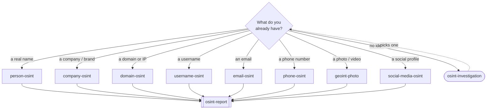
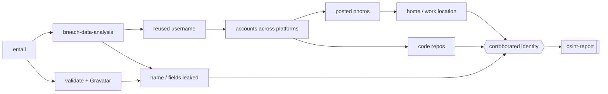
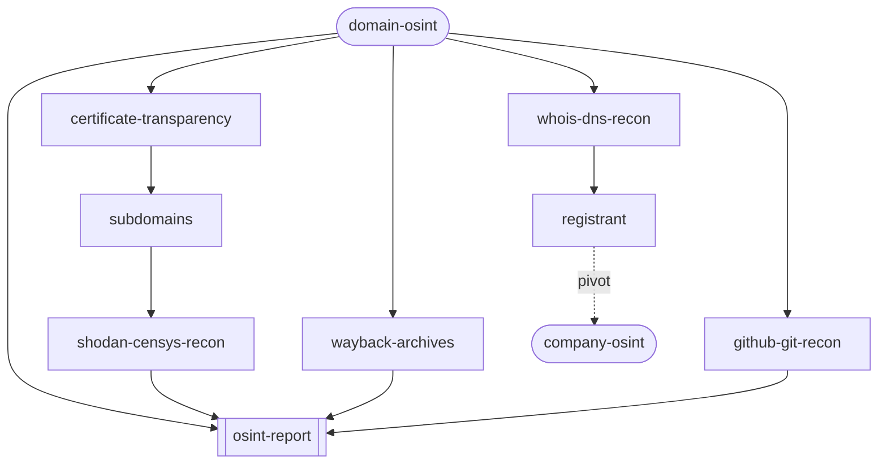

<div align="center">

# 🕵️ OSINT Skills

**Open-source intelligence, run by your AI agent.**

Reconnaissance · Attribution · GEOINT · Breach checks · Due diligence

[](LICENSE)
[](#workflows--you-type-these)
[](https://www.skills.sh/useosint/osint-skills)
[](#install)
[](ETHICS.md)
[](CONTRIBUTING.md)

</div>

---

28 skills that let Cursor, Claude, and other coding agents actually run an
open-source-intelligence investigation — pivot from an email to a breach to a
reused handle to a real name, geolocate a photo from the pixels, map a
company's subsidiaries — and write it up with sources instead of vibes.

Two kinds:

- **10 you run by name** — end-to-end workflows for a person, company, domain,
  username, email, phone, photo, or social account.
- **18 the agent reaches for on its own** — the individual techniques those
  workflows lean on (reverse image search, WHOIS, certificate transparency,
  breach lookups, chronolocation, and so on).

You point it at a target. It picks the workflow, chains the techniques, and
hands back a report where every claim has a source and a confidence level.

## What a run looks like

```
> domain-osint example.com

scope        passive only, no scanning
whois        NameCheap, created 2019-03-11, registrant behind privacy guard
dns          MX → Google Workspace · SPF lists sendgrid + mailgun
crt.sh       14 subdomains, incl. staging.example.com and vpn.example.com
shodan       vpn:443 Fortinet · staging exposes :8080 Jenkins (no auth)
wayback      2021 team page named 6 staff, since deleted

pivoted 3 staff → LinkedIn, flagged the open Jenkins, wrote report.md
```

Illustrative — a real run depends on the target and which tools you have keys
for. The skills are the technique and the tooling; some tools (Shodan, HIBP,
DeHashed) want their own API key, and free alternatives are called out inline.

## Install

```bash
git clone https://github.com/useosint/osint-skills.git
cd osint-skills
./install.sh
```

`install.sh` symlinks all 28 skills into `~/.cursor/skills`, so `git pull` keeps
them current. Restart your agent afterward.

| Command | Installs to |
|---------|-------------|
| `./install.sh` | `~/.cursor/skills` (symlink) |
| `./install.sh --copy` | same, but copies |
| `./install.sh --claude` | `~/.claude/skills` |
| `./install.sh --target DIR` | anywhere |

For a single project instead of your whole machine, drop the `skills/` folder
into that repo's `.cursor/skills/`.

## Where to start

Pick the workflow that matches whatever you're holding. If you don't know,
`osint-investigation` routes you.



## Workflows — you type these

| Skill | Does |
|-------|------|
| `osint-investigation` | Router. Not sure where to start? Start here. |
| `person-osint` | Profile an individual from public data |
| `company-osint` | Due diligence — entity, people, infra, risk |
| `domain-osint` | Passive recon on a domain, site, or IP |
| `username-osint` | Chase a handle across hundreds of platforms |
| `email-osint` | Validate, find linked accounts and breaches |
| `phone-osint` | Line type, carrier, messaging apps, owner |
| `geoint-photo` | Where and when was this taken |
| `social-media-osint` | Network, content, location, pattern of life |
| `osint-report` | Turn the findings into a sourced brief |

## Techniques — the agent pulls these in as needed

| Skill | For |
|-------|-----|
| `reverse-image-search` | Source of an image across Yandex, Lens, Bing, TinEye |
| `exif-metadata-analysis` | GPS, timestamps, author, software from files |
| `whois-dns-recon` | Registration and DNS records |
| `certificate-transparency` | Subdomains from CT logs (crt.sh) |
| `wayback-archives` | Deleted and historical pages |
| `google-dorking` | Search operators that find the buried stuff |
| `github-git-recon` | People and leaked secrets in repos and git history |
| `chronolocation` | Geolocate and time-stamp imagery from clues alone |
| `sockpuppet-opsec` | Not getting made while you look |
| `breach-data-analysis` | HIBP and dumps |
| `crypto-blockchain-tracing` | Follow BTC/ETH wallets |
| `flight-vessel-tracking` | Planes (ADS-B) and ships (AIS) |
| `shodan-censys-recon` | Exposed hosts and services, without scanning |
| `paste-forum-monitoring` | Pastes, forums, Telegram leaks |
| `media-verification` | Deepfakes, edits, recycled photos |
| `people-search-engines` | Data brokers and public records |
| `corporate-registries` | Companies, officers, beneficial owners |
| `link-analysis-graphing` | Wire the findings into a graph |

## How a case actually moves

It's a chain of pivots. One thing you know turns into the next, until the
picture holds together under more than one source. Start with an email and it
can unfold like this:



Every hop is one of the technique skills; nothing gets called a fact off a
single weak match. And a workflow isn't one lookup — `domain-osint`, for
example, fans out across several techniques at once:



## Rules

OSINT is collecting information that is already public, for a legitimate reason.
That's legal most places. Logging into someone's accounts, using leaked
passwords, scanning boxes you don't own, stalking, doxxing — that isn't, and
it's not what any of this is for.

Every workflow makes you state scope and authorization before it does anything,
and stays passive by default. The details are in [ETHICS.md](ETHICS.md). If your
goal is to hurt a specific person, these skills aren't for you.

## Contributing

One folder, one `SKILL.md`, passive-first, every technique backed by a real
tool and source. [CONTRIBUTING.md](CONTRIBUTING.md) has the rest.

## License

[MIT](LICENSE). No warranty. What you do with it is on you.
